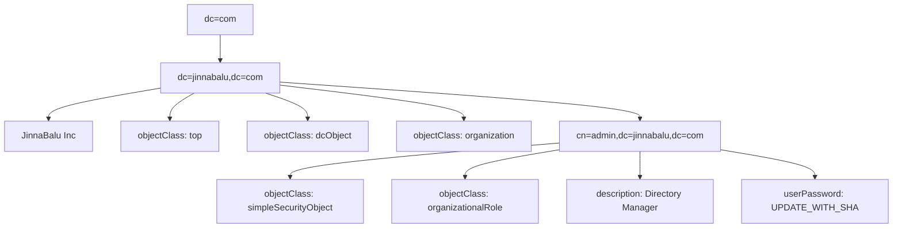

# Initialize the LDAP directory

Generate the password hash then use in init `ldif`

```bash

slappasswd -schangeme

{SSHA}JZh7YlO68Y2zhTGHPj7vgE8sGEYmDpCx

```

Create an LDIF file `init.ldif` with your directory structure.



```ldif
dn: dc=jinnabalu,dc=com
objectClass: top
objectClass: dcObject
objectClass: organization
o: JinnaBalu Inc
dc: jinnabalu

dn: cn=admin,dc=jinnabalu,dc=com
objectClass: simpleSecurityObject
objectClass: organizationalRole
cn: admin

description: Directory Manager

userPassword: {SSHA}JZh7YlO68Y2zhTGHPj7vgE8sGEYmDpCx
```

In this ldif:

- The root node `dc=com` is the top-level domain component.
- The `dc=jinnabalu,dc=com` node is a child of `dc=com`.
- The attributes and object classes for `dc=jinnabalu,dc=com` are shown as children of this node.
- The `cn=admin,dc=jinnabalu,dc=com` node is a child of `dc=jinnabalu,dc=com`.
- The attributes and object classes for `cn=admin,dc=jinnabalu,dc=com` are shown as children of this node.

This structure accurately represents the hierarchical nature of LDAP directories.

**Add**

```bash
# On-host
sudo ldapadd-x-Dcn=admin,dc=jinnabalu,dc=com-W-finit.ldif
# Container
docker exec -it openldap 

```

**Search** : Verify the above records updated

```bash

ldapsearch -x-LLL-bdc=jinnabalu,dc=com


# OUTPUT:

dn: dc=jinnabalu,dc=com

objectClass: top

objectClass: dcObject

objectClass: organization

o: JinnaBaluInc

dc: jinnabalu

```
