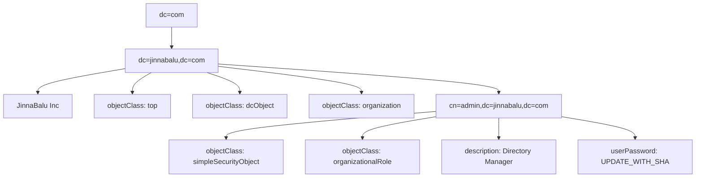
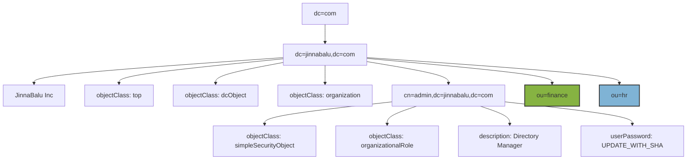

## Search
```bash
ldapsearch -H ldap://localhost:389 -x -D "cn=admin,dc=jinnabalu,dc=com" -W -b "dc=jinnabalu,dc=com" "(objectClass=*)"
```
- `-H ldap://localhost:389`: Specifies the LDAP URI in the correct format. The URI scheme ldap:// indicates LDAP protocol on port 389 for localhost.
- `-x`: Indicates simple authentication (not SASL).
- `-D "cn=admin,dc=jinnabalu,dc=com"`: Specifies the bind DN (Distinguished Name) for authentication.
- `-W`: Prompts for the password of the bind DN.
- `-b "dc=jinnabalu,dc=com"`: Specifies the base DN for the search.
- `"(objectClass=*)"`: The search filter to find all entries.
  
```
# extended LDIF
#
# LDAPv3
# base <dc=jinnabalu,dc=com> with scope subtree
# filter: (objectClass=*)
# requesting: ALL

# jinnabalu.com
dn: dc=jinnabalu,dc=com
objectClass: top
objectClass: dcObject
objectClass: organization
o: JinnaBalu Inc
dc: jinnabalu

# search result
search: 2
result: 0 Success

# numResponses: 2
# numEntries: 1
balu@raspberrypi:/etc/ldap/slapd.d $ ldapsearch -H ldap://localhost:389 -x -D "cn=admin,dc=jinnabalu,dc=com" -W -b "dc=jinnabalu,dc=com" "(objectClass=*)" -LLL
Enter LDAP Password: 
dn: dc=jinnabalu,dc=com
objectClass: top
objectClass: dcObject
objectClass: organization
o: JinnaBalu Inc
dc: jinnabalu
```
## Add
#### Before : 

#### After


**Create the files for adding two new branches**

- `add_ou_finance.ldif`
```bash file=add_ou_finance.ldif
dn: ou=hr,dc=jinnabalu,dc=com
objectClass: organizationalUnit
ou: hr
```
- `add_ou_hr.ldif`
```bash
dn: ou=hr,dc=jinnabalu,dc=com
objectClass: organizationalUnit
ou: hr
```

**Add file to the ldap **
```bash
ldapadd -H ldap://localhost:389 -x -D "cn=admin,dc=jinnabalu,dc=com" -W -f add_ou_finance.ldif
# OUTPUT: Enter LDAP Password: 
adding new entry "ou=finance,dc=jinnabalu,dc=com"

ldapadd -H ldap://localhost:389 -x -D "cn=admin,dc=jinnabalu,dc=com" -W -f add_ou_hr.ldif
# OUTPUT
Enter LDAP Password: 
adding new entry "ou=hr,dc=jinnabalu,dc=com"
```
**Validate**
```bash
ldapsearch -H ldap://localhost:389 -x -D "cn=admin,dc=jinnabalu,dc=com" -W -b "dc=jinnabalu,dc=com" "(objectClass=organizationalUnit)" -LLL
# OUTPUT
Enter LDAP Password: 
dn: ou=finance,dc=jinnabalu,dc=com
objectClass: organizationalUnit
ou: finance

dn: ou=hr,dc=jinnabalu,dc=com
objectClass: organizationalUnit
ou: hr
```
