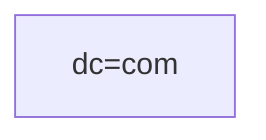
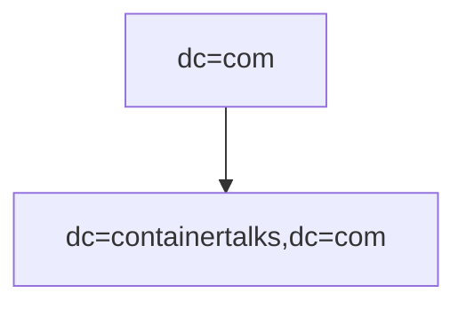
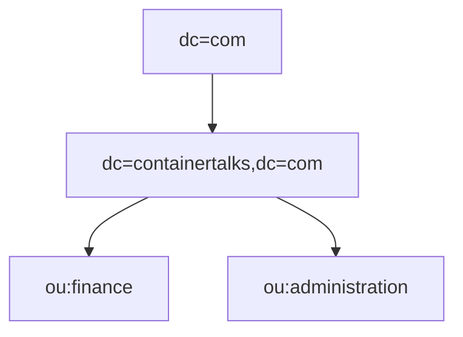
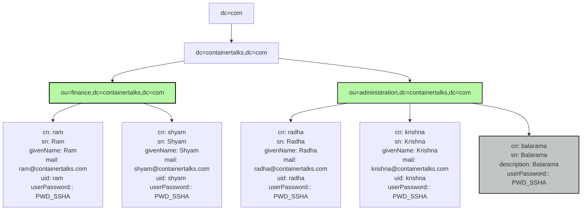

## LDAP Operations

Create the Organization, Organizational Unit and Users

#### Root

## Add Organization
Created the organization file [single-node/conf/ldifs/1.o-containertalks.ldif](https://github.com/jinnabaalu/openldap-tutorial/blob/main/single-node/conf/ldifs/1.o-containertalks.ldif) mounted to the container `/ldifs/1.o-containertalks.ldif`

#### Root, Organization

#### Add
```bash
$ docker exec -it openldap bash

$ ldapadd -x -D "cn=admin,dc=containertalks,dc=com" -W -f /ldifs/1.o-containertalks.ldif 
Enter LDAP Password: 
# OUTPUT
adding new entry "dc=containertalks,dc=com"
```

#### Search 
```bash
$ ldapsearch -x -LLL -D "cn=admin,dc=containertalks,dc=com" -W -b "dc=containertalks,dc=com" "(objectClass=*)"
Enter LDAP Password: 

# OUTPUT
dn: dc=containertalks,dc=com
objectClass: top
objectClass: dcObject
objectClass: organization
o: Containertalks Inc
dc: containertalks
```
## Add Branch (Organizational Unit)

Add the Organizational Unit file [single-node/conf/ldifs/2.ou-finance.ldif](https://github.com/jinnabaalu/openldap-tutorial/blob/main/single-node/conf/ldifs/2.1.ou-finance.ldif ) mounted to the container `/ldifs/2.1.ou-finance.ldif`

Add the Organizational Unit file [single-node/conf/ldifs/2.ou-administration.ldif](https://github.com/jinnabaalu/openldap-tutorial/blob/main/single-node/conf/ldifs/2.2.ou-administration.ldif ) mounted to the container `/ldifs/2.2.ou-administration.ldif`

#### Root, Organization, Branch
``

#### Add
```bash
$ docker exec -it openldap bash

$ ldapadd -x -D "cn=admin,dc=containertalks,dc=com" -W -f /ldifs/2.ou-finance.ldif 
Enter LDAP Password: 
# OUTPUT:
adding new entry "ou=finance,dc=containertalks,dc=com"

$ ldapadd -x -D "cn=admin,dc=containertalks,dc=com" -W -f /ldifs/2.ou-administration.ldif

# OUTPUT
adding new entry "ou=administration,dc=containertalks,dc=com"
```
#### Search 
```bash
$ ldapsearch -x -LLL -D "cn=admin,dc=containertalks,dc=com" -W -b "dc=containertalks,dc=com" "(objectClass=organizationalUnit)"
Enter LDAP Password: 
# OUTPUT
dn: ou=finance,dc=containertalks,dc=com
objectClass: top
objectClass: organizationalUnit
ou: finance

dn: ou=administration,dc=containertalks,dc=com
objectClass: top
objectClass: organizationalUnit
ou: administration
```

## Add User
I am going to add the 5 different users
- Ram, Shyam users under `ou:finance` of type `objectClass: inetOrgPerson`
- Radha and Krishna users under `ou:administration` of type `objectClass: inetOrgPerson`
- Balaram user under `ou:administration` of type `objectClass: person`

All the files are defined in []() mounted to the container `/ldifs/`
```bash
├── 2.1.1.inetOrgPerson-ram.ldif
├── 2.1.2.inetOrgPerson-shyam.ldif
├── 2.2.1.inetOrgPerson-krishna.ldif
├── 2.2.1.inetOrgPerson-radha.ldif
├── 4.person-balaram.ldif
```

Add the user ldif file [single-node/conf/ldifs/](https://github.com/jinnabaalu/openldap-tutorial/blob/main/single-node/conf/ldifs/2.2.ou-administration.ldif ) mounted to the container `/ldifs/`


#### Root, Organization, Branch, User


#### Add
```bash
$ docker exec -it openldap bash

$ ldapadd -x -D "cn=admin,dc=containertalks,dc=com" -W -f /ldifs/2.1.1.inetOrgPerson-ram.ldif
ldapadd -x -D "cn=admin,dc=containertalks,dc=com" -W -f /ldifs/2.1.2.inetOrgPerson-shyam.ldif
ldapadd -x -D "cn=admin,dc=containertalks,dc=com" -W -f /ldifs/2.2.1.inetOrgPerson-krishna.ldif
ldapadd -x -D "cn=admin,dc=containertalks,dc=com" -W -f /ldifs/2.2.1.inetOrgPerson-radha.ldif
ldapadd -x -D "cn=admin,dc=containertalks,dc=com" -W -f /ldifs/2.2.1.inetOrgPerson-radha.ldif
ldapadd -x -D "cn=admin,dc=containertalks,dc=com" -W -f /ldifs/4.person-balaram.ldif

# OUTPUT
adding new entry "cn=ram,ou=finance,dc=containertalks,dc=com"
adding new entry "cn=shyam,ou=finance,dc=containertalks,dc=com"
adding new entry "cn=krishna,ou=administration,dc=containertalks,dc=com"
adding new entry "cn=radha,ou=administration,dc=containertalks,dc=com"
adding new entry "cn=balarama,ou=administration,dc=containertalks,dc=com"
```

#### Search 
```bash
$ ldapsearch -x -LLL -D "cn=admin,dc=containertalks,dc=com" -W -b "dc=containertalks,dc=com" "(objectClass=*)"
Enter LDAP Password: 
dn: dc=containertalks,dc=com
objectClass: top
objectClass: dcObject
objectClass: organization
o: Containertalks Inc
dc: containertalks

dn: ou=finance,dc=containertalks,dc=com
objectClass: top
objectClass: organizationalUnit
ou: finance

dn: ou=administration,dc=containertalks,dc=com
objectClass: top
objectClass: organizationalUnit
ou: administration

dn: cn=ram,ou=finance,dc=containertalks,dc=com
objectClass: top
objectClass: person
objectClass: organizationalPerson
objectClass: inetOrgPerson
cn: ram
sn: Ram
givenName: Ram
mail: ram@containertalks.com
uid: ram
userPassword:: PWD_SSHA

dn: cn=shyam,ou=finance,dc=containertalks,dc=com
objectClass: top
objectClass: person
objectClass: organizationalPerson
objectClass: inetOrgPerson
cn: shyam
sn: Shyam
givenName: Shyam
mail: shyam@containertalks.com
uid: shyam
userPassword:: PWD_SSHA

dn: cn=radha,ou=administration,dc=containertalks,dc=com
objectClass: inetOrgPerson
cn: radha
sn: Radha
givenName: Radha
mail: radha@containertalks.com
uid: radha
userPassword:: PWD_SSHA

dn: cn=krishna,ou=administration,dc=containertalks,dc=com
objectClass: inetOrgPerson
cn: krishna
sn: Krishna
givenName: Krishna
mail: krishna@containertalks.com
uid: krishna
userPassword:: PWD_SSHA

dn: cn=balarama,ou=administration,dc=containertalks,dc=com
objectClass: person
cn: balarama
sn: Balarama
description: Balarama
userPassword:: PWD_SSHA
```

Other Search Examples
```bash 
 # search for all entries
ldapsearch -x -LLL -D "cn=admin,dc=containertalks,dc=com" -W -b "dc=containertalks,dc=com" "(objectClass=*)"
# search for all entires of objectClass person
ldapsearch -x -LLL -D "cn=admin,dc=containertalks,dc=com" -W -b "dc=containertalks,dc=com" "(objectClass=person)" 
# search for all entires of objectClass inetOrgPerson
ldapsearch -x -LLL -D "cn=admin,dc=containertalks,dc=com" -W -b "dc=containertalks,dc=com" "(objectClass=inetOrgPerson)"
# search for all entires of objectClass inetOrgPerson and uid=krishna
ldapsearch -x -LLL -D "cn=admin,dc=containertalks,dc=com" -W -b "cn=krishna,ou=administration,dc=containertalks,dc=com" "(objectClass=inetOrgPerson)"
```