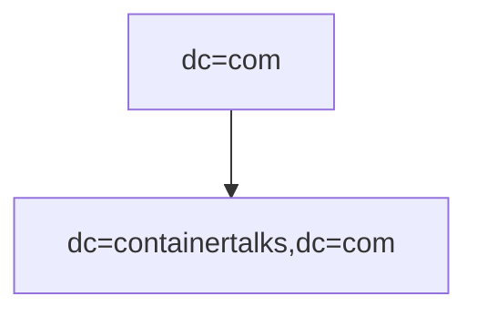
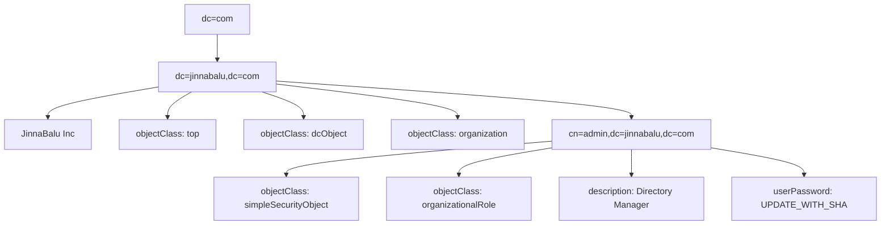
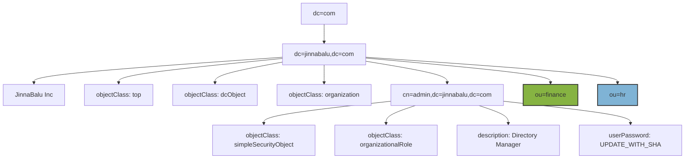

## LDAP Operations

Create the Organization, Organizational Unit and Users

#### Root


## Add Organization
Created the organization file [single-node/conf/ldifs/1.o-containertalks.ldif](https://github.com/jinnabaalu/openldap-tutorial/blob/main/single-node/conf/ldifs/1.o-containertalks.ldif) mounted to the container `/ldifs/1.o-containertalks.ldif`

#### Organization


```bash
ldapadd -x -D "cn=admin,dc=containertalks,dc=com" -W -f /ldifs/1.o-containertalks.ldif 
Enter LDAP Password: 
adding new entry "dc=containertalks,dc=com"
```

## Search 
```bash
root@4ff2df934c54:/# ldapsearch -x -LLL -D "cn=admin,dc=containertalks,dc=com" -W -b "dc=containertalks,dc=com" "(objectClass=*)"

Enter LDAP Password: 
# OUTPUT
dn: dc=containertalks,dc=com
objectClass: top
objectClass: dcObject
objectClass: organization
o: Containertalks Inc
dc: containertalks
```
## Add Branches (Organizational Units)
#### Before : 

#### After


**Create the files for adding two new branches**

- `add_ou_finance.ldif`
```bash file=add_ou_finance.ldif
dn: ou=hr,dc=jinnabalu,dc=com
objectClass: organizationalUnit
ou: hr
```
- `add_ou_hr.ldif`
```bash
dn: ou=hr,dc=jinnabalu,dc=com
objectClass: organizationalUnit
ou: hr
```

**Add file to the ldap **
```bash
ldapadd -H ldap://localhost:389 -x -D "cn=admin,dc=jinnabalu,dc=com" -W -f add_ou_finance.ldif
# OUTPUT: Enter LDAP Password: 
adding new entry "ou=finance,dc=jinnabalu,dc=com"

ldapadd -H ldap://localhost:389 -x -D "cn=admin,dc=jinnabalu,dc=com" -W -f add_ou_hr.ldif
# OUTPUT
Enter LDAP Password: 
adding new entry "ou=hr,dc=jinnabalu,dc=com"
```
**Validate**
```bash
ldapsearch -H ldap://localhost:389 -x -D "cn=admin,dc=jinnabalu,dc=com" -W -b "dc=jinnabalu,dc=com" "(objectClass=organizationalUnit)" -LLL
# OUTPUT
Enter LDAP Password: 
dn: ou=finance,dc=jinnabalu,dc=com
objectClass: organizationalUnit
ou: finance

dn: ou=hr,dc=jinnabalu,dc=com
objectClass: organizationalUnit
ou: hr
```


