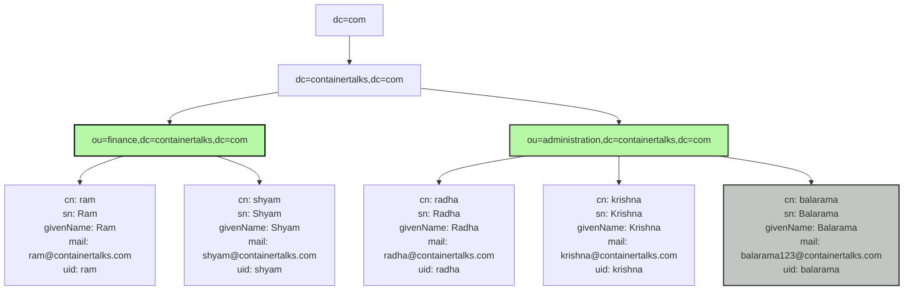

# OpenLDAP Tutorial

#### Introduction

Lightweight Directory Access Protocol (LDAP)



### 1. Docker

- 1.1 [Pre-requisites](https://github.com/jinnabaalu/openldap-tutorial/blob/main/prerequisites.md)
- 1.2 [Run the openldap container]()

`openldap` default conf, schemas, certs are available in the container at the following
```bash
$ cd /opt/bitnami/openldap/etc/ 
$ ls
certs  
ldap.conf  
schema  
slapd.d
```

### 2. On the Host

In this tutorial I am using the raspberry-pi, installed docker and docker-compose to run the ldap as container.

- 2.1. [Install OpenLDAP](https://github.com/jinnabaalu/openldap-tutorial/blob/main/2.1.Install-OpenLDAP-on-the-Host.md)
- 2.2. [Understanding file structure](https://github.com/jinnabaalu/openldap-tutorial/blob/main/2.2.Understanding-filep-structure.md)

### 3. Common Operations
- 3.1 [LDAP Operations](https://github.com/jinnabaalu/openldap-tutorial/blob/main/3.2.LDAPOperations.md)
- 3.2 [Backup and Restore](https://github.com/jinnabaalu/openldap-tutorial/blob/main/3.2.Backup-and-Restore.md)

###### Common LDAP Terms and Concepts

- `DIT (Directory Information Tree)`: The hierarchical structure of the LDAP directory.
- `dn (Distinguished Name)`: The unique name that identifies an entry in the LDAP directory.
- `dc (Domain Component)`: Used to represent parts of a domain name. Example: dc=example, dc=com.
- `cn (Common Name)`: Typically used for a person's full name or an identifier for an entry. Example: cn=John Doe.
- `o (Organization)`: Represents the name of an organization. Example: o=Example Organization.
- `ou (Organizational Unit)`: Used to group entries logically within an organization. Example: ou=Engineering.
- `ldif` :
- `uid (User ID)`: Unique identifier for a user. Example: uid=jdoe.
- `sn (Surname)`: Last name or family name. Example: sn=Doe.
- `givenName`: First name or given name. Example: givenName=John.
- `mail`: Email address. Example: mail=jdoe@example.com.
- `telephoneNumber`: Telephone number. Example: telephoneNumber=123-456-7890.
- `c (Country Name)`: Represents a country. Example: c=US.
- `l (Locality Name)`: Represents a city or locality. Example: l=New York.
- `st (State or Province Name)`: Represents a state or province. Example: st=New York.
- `postalCode`: Represents a postal code. Example: postalCode=10001.
- `objectClass`: Defines the schema or structure for an entry. Example: objectClass=inetOrgPerson.
- `dcObject`: An object class used to define domain components.
- `organizationalUnit`: An object class for defining organizational units.
- `inetOrgPerson`: An object class that represents people in an LDAP directory.
- `organizationalRole`: Represents roles within an organization.
- `simpleSecurityObject`: An object class used for storing passwords.
- `schema`: Defines the attributes and object classes that can be used in the directory.
- `description`: A general description attribute. Example: description=Directory Manager.
- `userPassword`: Stores the password for an entry. Example: userPassword=secret.
- `entry`: A single record or node in the LDAP directory.
- `LDIF (LDAP Data Interchange Format)` A standard plain-text format for representing LDAP directory entries and updates. LDIF files are used to import and export directory data.
  ```bash
  dn: cn=Jinn Balu,dc=jinnabalu,dc=com
  objectClass: inetOrgPerson
  cn: Jinna Balu
  sn: Balu
  uid: jbalu
  mail: admin@jinnabalu.com
  ```
